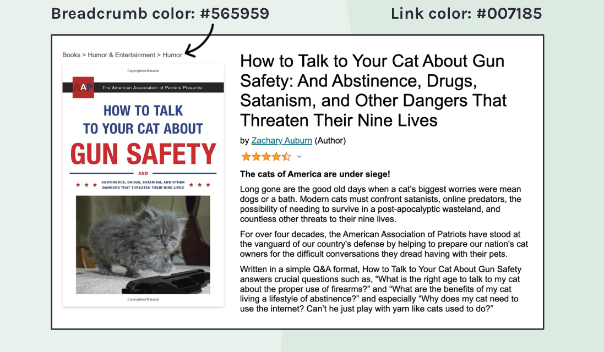

# Amazon Product Page

An Amazon product page for a book, built with HTML and CSS. This was my second solo project from the Scrimba HTML and CSS Tutorial.

## Design vs. Implementation

### Design Specifications

### My Implementation

## Technologies Used
- HTML5
- CSS

## What I Learned
- Image alt texts
- Flex child containers
- Inheritance
- Web safe fonts

